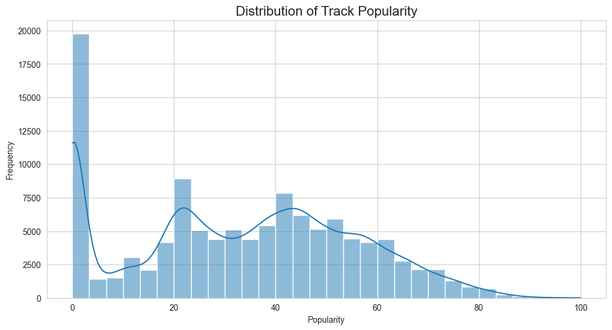
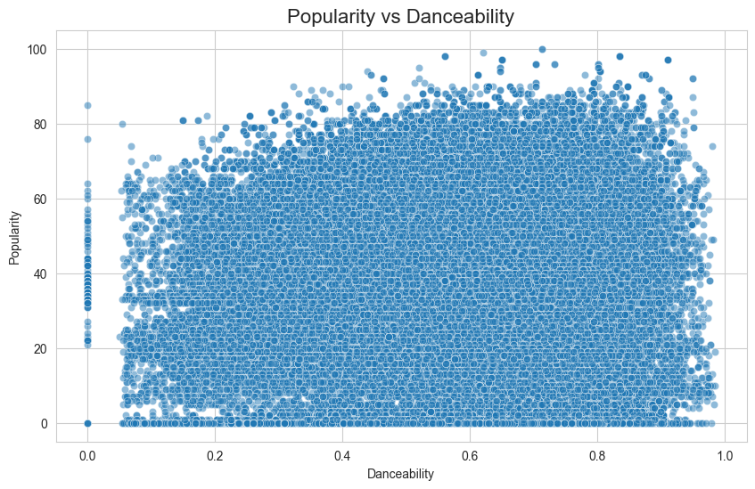
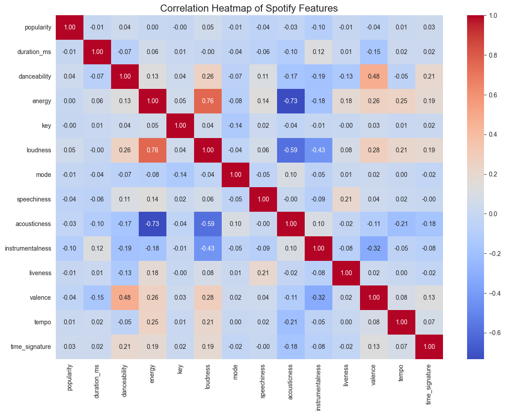
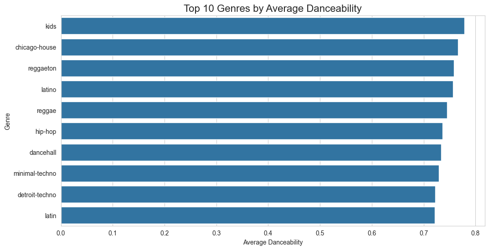

# 🎵 Spotify Exploratory Data Analysis (EDA) Project

## 📌 Project Overview

This project performs Exploratory Data Analysis (EDA) on Spotify music data to uncover patterns related to track popularity, audio characteristics, emotional features, and genre-based trends.

The analysis explores how factors such as danceability, energy, loudness, tempo, valence, and explicit content influence listener engagement across Spotify’s music catalog.

---

## 🎯 Objectives

- Analyze Spotify track audio features
- Understand factors influencing track popularity
- Explore relationships between musical characteristics
- Compare genre-wise music behavior
- Generate business-oriented insights from streaming data

---

## 🛠️ Technologies Used

- Python
- Pandas
- NumPy
- Matplotlib
- Seaborn
- Jupyter Notebook

---

## 📂 Project Structure

```text
spotify-eda-project/
│
├── data/
├── notebooks/
├── visuals/
├── dashboard/
├── reports/
├── README.md
└── requirements.txt
```


---

# 📊 Key Insights

- Most Spotify tracks exhibit moderate-to-high danceability and energy levels.
- Track popularity does not depend on a single audio feature but rather a combination of musical characteristics.
- Danceability and energy demonstrate moderate positive relationships across tracks.
- Explicit tracks show slightly higher median popularity compared to non-explicit tracks.
- Genres such as K-pop, pop-film, and chill achieved strong average popularity performance.
- Metal and electronic genres displayed the highest average energy levels.
- Latin and rhythm-focused genres demonstrated the highest danceability scores.

---

# 📈 Visualization Highlights

## Popularity Distribution



---

## Popularity vs Danceability



---

## Correlation Heatmap



---

## Genre-wise Danceability Analysis




---

# 🚀 Future Improvements

- Build an interactive Streamlit dashboard for real-time exploration
- Develop a machine learning model for track popularity prediction
- Perform sentiment analysis on song lyrics
- Add artist-level and album-level analytics
- Integrate recommendation system techniques
- Deploy the project publicly using Streamlit Cloud

---

# 📌 Conclusion

This project successfully explored Spotify music data using Exploratory Data Analysis techniques to uncover relationships between popularity, audio characteristics, emotional tone, and genre behavior.

The analysis demonstrated that music engagement patterns on Spotify are influenced by multiple interacting features rather than a single dominant factor.

Overall, the project provides a strong foundation for future work in music intelligence, recommendation systems, and predictive analytics.

---

# 👨‍💻 Author

**Arpit**

Aspiring Data Analyst | Python & Data Analytics Enthusiast

---