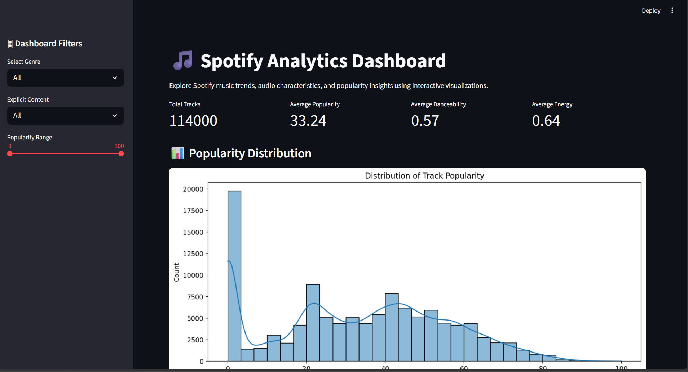

# 🎵 Spotify Exploratory Data Analysis (EDA) Project

## 🌐 Live Dashboard

🔗 https://spotify-eda-project-2026.streamlit.app/

---

# 📌 Project Overview

This project performs comprehensive Exploratory Data Analysis (EDA) on Spotify music data to uncover trends related to track popularity, audio characteristics, listener engagement, and genre-based behavior.

The analysis investigates how musical features such as danceability, energy, loudness, tempo, valence, and explicit content influence song popularity across Spotify’s music catalog.

Additionally, an interactive Streamlit dashboard was developed to enable dynamic exploration of Spotify audio insights and genre analytics.

---

# 🎯 Project Objectives

- Analyze Spotify track audio features
- Understand factors influencing track popularity
- Explore relationships between musical characteristics
- Compare genre-wise music behavior
- Generate business-oriented insights from streaming data
- Build an interactive analytics dashboard using Streamlit

---

# 🛠️ Technologies Used

## Programming & Analysis
- Python
- Pandas
- NumPy

## Data Visualization
- Matplotlib
- Seaborn

## Dashboard & Deployment
- Streamlit
- Streamlit Community Cloud

## Development Environment
- Jupyter Notebook
- VS Code
- Git & GitHub

---

# 📂 Project Structure

```text
spotify-eda-project/
│
├── data/
│   ├── raw/
│   └── cleaned/
│
├── notebooks/
│   ├── 01_data_cleaning.ipynb
│   ├── 02_univariate_analysis.ipynb
│   ├── 03_bivariate_analysis.ipynb
│   ├── 04_multivariate_analysis.ipynb
│   └── 05_final_insights.ipynb
│
├── visuals/
│   ├── charts/
│   └── dashboard_preview.png
│
├── dashboard/
│   └── streamlit_app.py
│
├── reports/
├── README.md
└── requirements.txt
```

---

# 📊 Key Insights

- Most Spotify tracks exhibit moderate-to-high danceability and energy levels.
- Track popularity is influenced by multiple interacting audio characteristics rather than a single dominant feature.
- Danceability and energy demonstrate moderate positive relationships across tracks.
- Explicit tracks show slightly higher median popularity compared to non-explicit tracks.
- Genres such as K-pop, pop-film, and chill achieved strong average popularity performance.
- Metal and electronic genres displayed the highest average energy levels.
- Latin and rhythm-focused genres demonstrated the highest danceability scores.

---

# 📈 Visualization Highlights

## 🎧 Popularity Distribution


---

## 💃 Popularity vs Danceability


---

## 🔥 Correlation Heatmap


---

## 🎼 Genre-wise Danceability Analysis


---

# 📊 Interactive Dashboard

The project also includes a fully interactive Streamlit dashboard for exploring Spotify music trends dynamically.

## Dashboard Features

- Interactive KPI cards
- Genre-based filtering
- Popularity analysis
- Audio feature visualizations
- Correlation heatmaps
- Interactive scatterplots

---

# 🚀 Future Improvements

- Build machine learning models for popularity prediction
- Develop music recommendation systems
- Integrate Spotify API for live analytics
- Perform sentiment analysis on song lyrics
- Add artist-level and album-level insights
- Create Power BI and Tableau dashboard versions

---

# 📌 Conclusion

This project successfully explored Spotify music data using Exploratory Data Analysis techniques to uncover relationships between popularity, audio characteristics, emotional tone, and genre behavior.

The findings demonstrate that listener engagement patterns are shaped by multiple interacting musical attributes rather than a single defining feature.

Overall, the project provides a strong foundation for future work in music intelligence, recommendation systems, and predictive analytics.

---

# 👨‍💻 Author

## Arpit

Aspiring Data Analyst | Python & Data Analytics Enthusiast

- GitHub: https://github.com/arpit-m-bangre

---